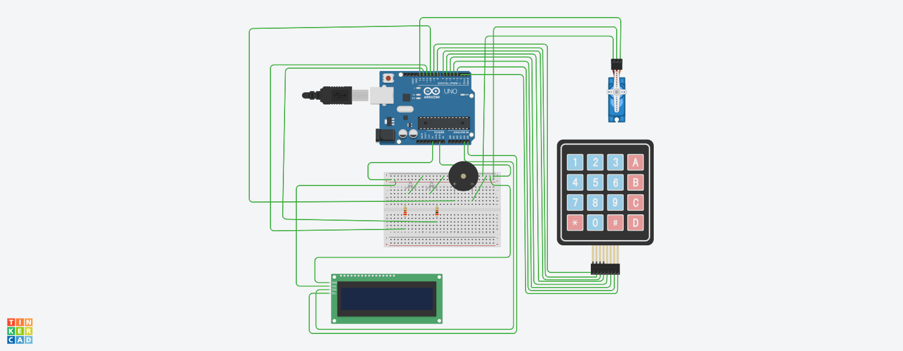

# Advanced Door Lock System | Arduino Based

This project is an **Advanced Security Door Lock System** built using Arduino.  
It provides secure access using passcode authentication, LCD interface, LEDs, buzzer, and a servo-controlled lock.

---

## Hardware Components Used

| Component | Quantity |
|----------|:--------:|
| Arduino Board | 1 |
| 4x4 Keypad | 1 |
| 16x2 LCD Display | 1 |
| Servo Motor | 1 |
| Red LED | 1 |
| Green LED | 1 |
| Buzzer | 1 |
| Resistors | 2 |
| Breadboard | 1 |
| Jumper Wires | As required |

---

## System Overview

- **Keypad** → Used to enter passcode & navigate menus  
- **Red LED** → Door Locked  
- **Green LED** → Door Unlocked  
- **Buzzer** → Alerts after wrong passcode attempts  
- **Servo Motor** → Opens/Closes the door lock  

Once powered on, LCD displays:  
➡ “Enter # or * or A”

| Key | Function |
|------|----------|
| `*` | Display project overview and function list |
| `#` | Enter passcode to lock/unlock |
| `A` | Reset passcode |
| `B` | Backspace (Delete single digit) |
| `C` | Clear entire passcode input |
| `D` | Home Screen |
| `0-9` | Passcode digits |

---

## Description Mode (`*` Key)

Displays:
- Project name  
- Team members  
- Function of each keypad key  

---

## Unlock / Lock Door (`#` Key)

### Correct Passcode:
- LCD → **CORRECT PASSCODE**
- Servo unlocks the door
- Red LED OFF, Green LED ON
- LCD → **“DOOR UNLOCKED”**

### Incorrect Passcode:
- 3 attempts allowed
- After failed 3 times:
  - Buzzer sounds for 10 sec
  - LCD → **“SECURITY ALERT”**
  - Returns to Home Screen

---

## Reset Passcode (`A` Key)

### If old passcode is correct:
- Prompts user to enter new passcode
- LCD → **“New Passcode Changed Successfully”**

### If old passcode is incorrect:
- Buzzer sounds for 5 sec
- LCD → **“SECURITY ALERT”**
- Returns to Home Screen

---

## Limitations

- If an unknown user enters the correct passcode, the door unlocks.
- Fingerprint sensor could not be integrated due to hardware limitations.
- Mechanical locking is limited by servo and knob structure.

---

## Circuit Diagram

  
   <b>Advanced Door Lock System – Circuit Diagram</b>

---

## Future Enhancements

- Fingerprint-based secondary authentication  
- IoT-based lock monitoring  
- Mobile application control  
- Auto-lock timing  
- Camera capture on failed attempts  

---

